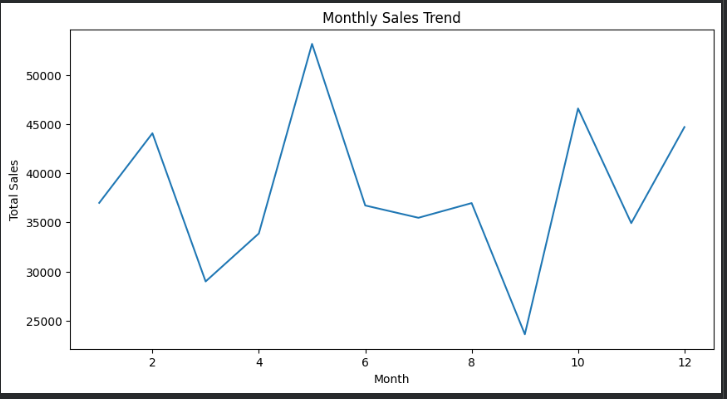
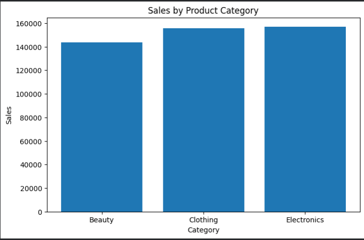
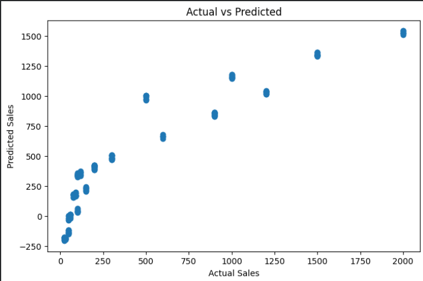
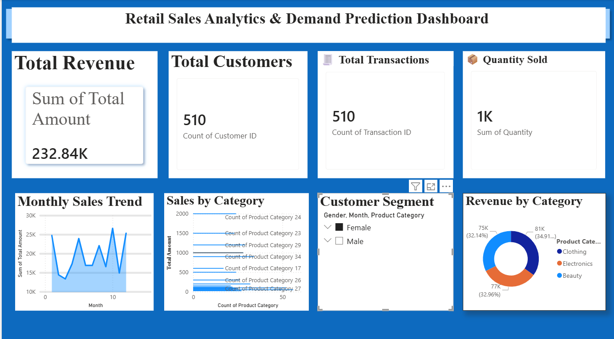

# Retail Sales Analytics & Demand Prediction Dashboard

## Project Overview

This project analyzes retail transaction data to understand customer purchasing behavior, identify sales trends, and generate business insights through visualization and predictive analytics.

---

## Technologies Used

- Python
- Pandas
- NumPy
- Matplotlib
- Scikit-learn
- SQL
- Power BI
- Streamlit

---

## Project Workflow

1. Data Collection
2. Data Cleaning
3. Feature Engineering
4. Exploratory Data Analysis
5. SQL Analysis
6. Machine Learning Prediction
7. Dashboard Creation
8. Deployment

---

## Dashboard Preview

### Monthly Sales Trend

### Product Category Analysis

### Prediction Model

### Power BI Dashboard

---

## Business Insights

• Product categories contribute differently to revenue generation.

• Customer purchasing behavior varies across demographics.

• Monthly trends reveal seasonal patterns.

• Data-driven insights can improve inventory planning.

---

## Resume Highlights

- Built an end-to-end Retail Sales Analytics Dashboard using Python, SQL, Power BI, and Machine Learning.

- Performed data cleaning and feature engineering on transactional datasets.

- Developed interactive dashboards and predictive models for business insights.

---

## Future Scope

- Real-time sales tracking
- Advanced forecasting models
- Customer segmentation using clustering
